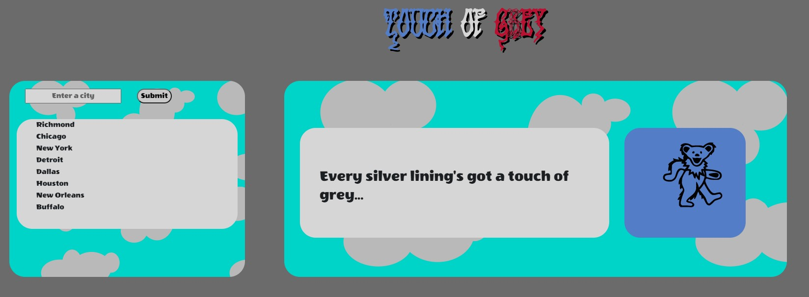
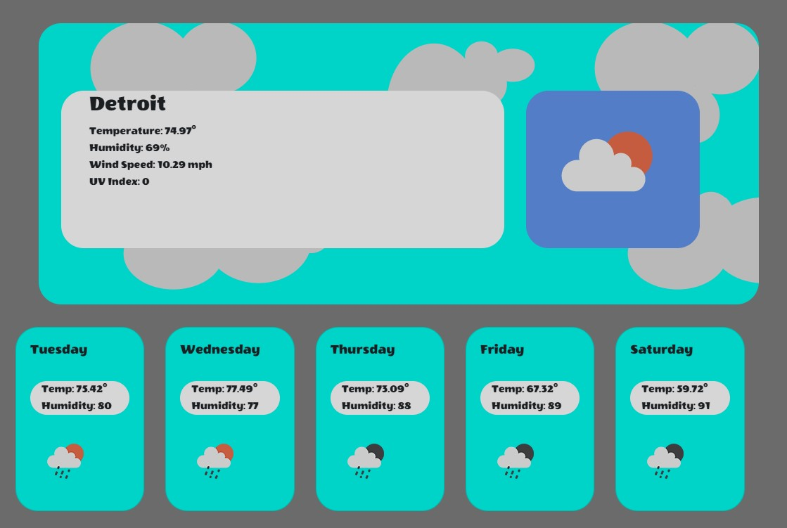
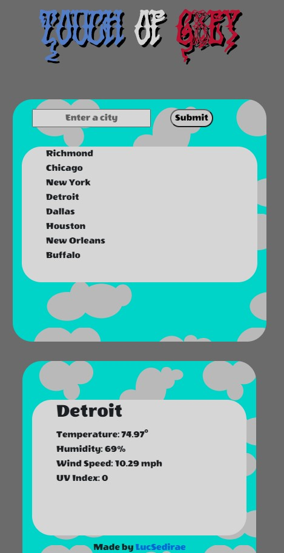

# Touch of Grey - Weather Dashboard

https://lucsedirae.github.io/weather-dashboard/ 
Touch of Grey is a weather dashboard application that features a Grateful Dead theme 
Upon loading the app, the user is greeted with awelcome message and a search field. 
When the user enters a city name (currently only city names are supported, future versions 
will allow for search by state for improved specificity). When the user clicks the 
submit button, details of that city's current weather are displayed in the main details 
section of the page. Below the details section, a 5-day forecast is populated to give 
forecast information.  

 
Cities that the user searches for are saved in their local storage and retrieved on loading 
the site. This allows users to click on a previously searched city and instantly retrieve 
current weather details. 

 
The site is also designed with a mobile responsive layout. On tablets and phones 
the page will stack allowing users to clearly see all of the same desktop information on 
devices with smaller display areas 

